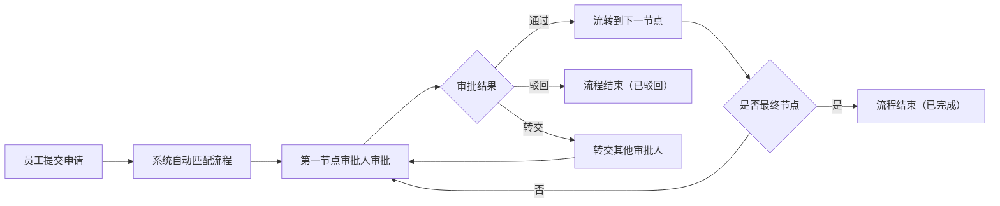

## 1. 产品概述

多角色审批工作台是一个面向企业内部的审批管理系统，解决多部门、多层级的审批流程管理问题，提升审批效率和透明度。

- 主要用途：集中管理各类审批申请，可视化展示审批流程，配置权限角色，记录操作历史，数据分析与异常监控
- 目标用户：企业管理者、部门审批人、普通员工、系统管理员
- 产品价值：规范审批流程、提升协作效率、数据驱动决策、风险预警与控制

## 2. 核心功能

### 2.1 用户角色

| 角色 | 注册方式 | 核心权限 |
|------|----------|----------|
| 系统管理员 | 后台创建 | 全系统权限管理、角色配置、流程定义 |
| 部门经理 | 后台创建 | 审批本部门申请、查看部门统计 |
| 普通员工 | 后台创建 | 提交申请、查看申请状态、查看个人记录 |
| 财务人员 | 后台创建 | 财务相关审批、财务数据统计 |
| HR 专员 | 后台创建 | 人事相关审批、人事数据统计 |

### 2.2 功能模块

1. **仪表盘**：数据概览、关键指标卡、异常提醒通知
2. **申请列表**：申请单列表、筛选搜索、详情查看、状态跟踪
3. **审批流节点**：流程可视化、节点配置、流转规则设置
4. **权限角色**：角色管理、权限分配、用户管理
5. **操作记录**：操作日志、审计追踪、筛选导出
6. **统计图**：多维度数据分析、图表可视化、趋势预测

### 2.3 页面详情

| 页面名称 | 模块名称 | 功能描述 |
|----------|----------|----------|
| 仪表盘 | 数据概览 | 展示待办数量、审批通过率、平均处理时长等关键指标 |
| 仪表盘 | 异常提醒 | 显示超时审批、异常流程、高风险申请等预警信息 |
| 申请列表 | 申请管理 | 支持按状态/类型/时间筛选，查看详情，发起新申请 |
| 申请列表 | 详情查看 | 展示申请详情、审批历史、当前节点、可执行操作 |
| 审批流节点 | 流程设计 | 可视化流程编辑器，拖拽配置审批节点和流转规则 |
| 审批流节点 | 流程列表 | 管理所有审批流程，启用/禁用，版本管理 |
| 权限角色 | 角色管理 | 创建编辑角色，配置功能权限和数据权限 |
| 权限角色 | 用户管理 | 用户列表，分配角色，启用/禁用账号 |
| 操作记录 | 日志列表 | 完整操作日志，支持多条件筛选和导出 |
| 统计图 | 数据看板 | 柱状图、折线图、饼图等多维度数据可视化 |

## 3. 核心流程

**审批申请主流程**：
1. 员工登录系统，进入申请列表页面
2. 点击"新建申请"，选择申请类型，填写表单信息
3. 提交申请，系统根据流程定义自动流转到第一个审批节点
4. 审批人收到待办提醒，查看申请详情，执行"通过/驳回/转交"操作
5. 系统根据审批结果自动流转到下一节点或结束流程
6. 申请人实时查看申请状态和审批历史
7. 所有操作自动记录到操作日志

## 4. 用户界面设计

### 4.1 设计风格

- **设计方向**：现代企业级专业风格，采用深蓝主色调搭配灰色系，传达专业、可靠、高效的品牌感
- **主色调**：#1e40af（深蓝）作为品牌主色，#0ea5e9（浅蓝）作为辅助色
- **强调色**：#10b981（绿色-通过）、#ef4444（红色-驳回/异常）、#f59e0b（橙色-待处理）
- **中性色**：#f8fafc（背景）、#1e293b（文本）、#64748b（次要文本）
- **按钮风格**：圆角 8px，悬停有阴影加深效果，主按钮使用渐变背景
- **字体**：标题使用"Inter"，正文使用"PingFang SC"，字号层级清晰（12px/14px/16px/20px/24px）
- **布局风格**：左侧导航 + 顶部面包屑 + 主内容区，卡片式布局，网格对齐
- **图标风格**：使用 lucide-react 线性图标，保持统一的 20px 尺寸

### 4.2 页面设计概述

| 页面名称 | 模块名称 | UI 元素 |
|----------|----------|----------|
| 仪表盘 | 数据概览 | 4-6 个指标卡片（带图标、数值、趋势箭头），顶部渐变横幅，卡片悬停上浮效果 |
| 仪表盘 | 异常提醒 | 列表式提醒，带状态标签和紧急程度标识，红点未读提示 |
| 申请列表 | 申请管理 | 顶部搜索筛选区 + Tab 状态切换 + 数据表格 + 分页器，行悬停高亮 |
| 审批流节点 | 流程设计 | 左侧节点组件库 + 中间画布区 + 右侧属性面板，节点连接线带箭头动画 |
| 权限角色 | 角色管理 | 左右分栏布局，左侧角色列表，右侧权限配置（树形结构复选框） |
| 操作记录 | 日志列表 | 时间轴式布局，每条记录带操作人头像、时间、操作类型标签 |
| 统计图 | 数据看板 | 响应式网格布局，多种图表类型，支持图例交互和数据钻取 |

### 4.3 响应式

- 采用桌面优先设计，默认适配 1440px 宽度
- 中等屏幕（1024px-1440px）：侧边栏收起为图标模式，内容区自适应
- 平板（768px-1024px）：顶部导航改为汉堡菜单，表格改为卡片列表
- 移动端（<768px）：单列布局，重点信息优先展示，复杂表格转为横向滚动

### 4.4 动画与交互

- 页面加载：元素从下往上渐入，带 50ms 错落延迟
- 卡片悬停：y 轴 -4px 上浮，阴影加深，过渡时长 200ms
- 按钮交互：点击时 scale(0.97) 缩放反馈
- 导航切换：平滑过渡，当前项有下划线滑动动画
- 数据更新：数值变化时有数字滚动动画
- 流程节点：连线有流动光效动画，表示审批流转中
