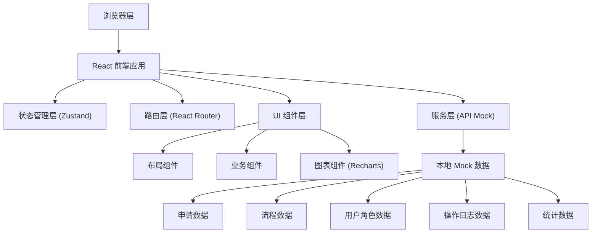

## 1. 架构设计



## 2. 技术描述

- **前端框架**：React@18 + TypeScript
- **构建工具**：Vite@5
- **样式方案**：Tailwind CSS@3 + CSS Variables
- **状态管理**：Zustand
- **路由管理**：React Router DOM@6
- **图表库**：Recharts@2
- **图标库**：Lucide React
- **后端**：无后端，使用本地 Mock 数据
- **数据库**：无数据库，使用 TypeScript 数据文件模拟

## 3. 路由定义

| 路由路径 | 页面名称 | 说明 |
|----------|----------|------|
| / | 仪表盘 | 数据概览、异常提醒、快捷入口 |
| /applications | 申请列表 | 申请单管理、筛选、详情 |
| /applications/:id | 申请详情 | 单个申请单详情页 |
| /workflows | 审批流节点 | 流程列表、流程设计器 |
| /permissions | 权限角色 | 角色管理、权限配置、用户管理 |
| /logs | 操作记录 | 操作日志列表、筛选、导出 |
| /statistics | 统计图 | 多维度数据分析图表 |

## 4. 数据模型

### 4.1 数据模型定义

```mermaid
erDiagram
    USER ||--o{ APPLICATION : "提交"
    USER ||--o{ OPERATION_LOG : "产生"
    ROLE ||--o{ USER : "分配"
    ROLE ||--o{ PERMISSION : "拥有"
    WORKFLOW ||--o{ APPLICATION : "使用"
    WORKFLOW ||--o{ WORKFLOW_NODE : "包含"
    APPLICATION ||--o{ APPROVAL_RECORD : "产生"
    APPLICATION ||--