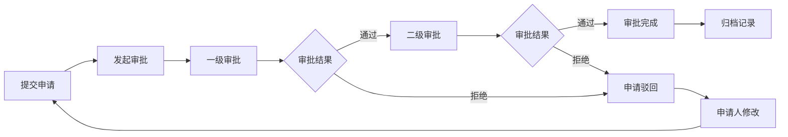

## 1. 产品概述

多角色审批工作台是一个企业级审批管理系统，用于管理各类业务申请的审批流程，支持多层级角色权限管理、流程可视化和数据分析。

- 核心目标：提供高效、透明的审批流程管理，支持多角色协作
- 目标用户：企业管理者、部门主管、审批人员、普通员工

## 2. 核心功能

### 2.1 用户角色

| 角色 | 注册方式 | 核心权限 |
|------|----------|----------|
| 超级管理员 | 系统预置 | 全功能权限、用户管理、角色配置 |
| 审批人 | 管理员分配 | 审批申请、查看审批流、查看操作记录 |
| 申请人 | 管理员分配 | 提交申请、查看申请状态、查看审批进度 |
| 观察者 | 管理员分配 | 查看申请列表、查看统计数据 |

### 2.2 功能模块

1. **申请列表**：展示所有申请记录，支持筛选、搜索和状态查看
2. **审批流节点**：可视化展示审批流程节点，支持查看当前审批进度
3. **权限角色**：管理用户角色和权限配置
4. **操作记录**：记录所有操作日志，支持审计追溯
5. **统计图**：数据可视化展示，包括申请趋势、审批效率等
6. **异常提醒**：实时显示审批异常和待办提醒

### 2.3 页面详情

| 页面名称 | 模块名称 | 功能描述 |
|----------|----------|----------|
| 工作台首页 | 数据概览 | 统计卡片、待办提醒、快捷入口 |
| 申请管理 | 申请列表 | 申请表格、筛选器、状态标签、详情弹窗 |
| 审批流程 | 审批流节点 | 流程图展示、节点详情、进度指示 |
| 权限管理 | 权限角色 | 角色列表、权限配置、用户分配 |
| 日志管理 | 操作记录 | 操作日志表格、时间筛选、搜索 |
| 数据分析 | 统计图 | 柱状图、折线图、饼图、数据表格 |
| 通知中心 | 异常提醒 | 异常列表、提醒通知、一键处理 |

## 3. 核心流程

## 4. 用户界面设计

### 4.1 设计风格

- **主色调**：深蓝色 (#1e40af) - 专业、稳重
- **辅助色**：青色 (#0d9488) - 成功状态、橙色 (#f59e0b) - 警告状态、红色 (#ef4444) - 异常状态
- **按钮样式**：圆角设计，hover时有阴影和微缩放效果
- **字体**：Geist Sans - 现代无衬线字体，清晰易读
- **布局风格**：左侧导航 + 右侧内容区，卡片式布局
- **图标风格**：Lucide React 线性图标

### 4.2 页面设计概览

| 页面名称 | 模块名称 | UI元素 |
|----------|----------|--------|
| 工作台首页 | 数据概览 | 统计卡片网格、环形进度条、通知徽章、渐变背景 |
| 申请管理 | 申请列表 | 数据表格、状态标签、搜索框、筛选下拉、分页 |
| 审批流程 | 审批流节点 | 时间轴流程图、节点卡片、连接线动画、状态指示 |
| 权限管理 | 权限角色 | 角色卡片、权限开关、用户列表、拖拽分配 |
| 日志管理 | 操作记录 | 时间线布局、操作图标、用户头像、详情展开 |
| 数据分析 | 统计图 | Recharts图表、数据卡片、图例说明、悬停提示 |
| 通知中心 | 异常提醒 | 通知卡片、优先级标识、动画提醒、批量操作 |

### 4.3 响应式

- 桌面端优先设计，适配1920px、1440px、1024px
- 平板端：左侧导航折叠为图标模式
- 移动端：底部导航栏，卡片单列布局

### 4.4 动画效果

- 页面加载：渐入 + 上移动画，元素错落显示
- 卡片悬停：阴影加深 + 轻微上浮
- 审批节点：当前节点脉冲动画
- 状态变更：平滑过渡动画
- 通知提醒：轻微抖动 + 数字变化动画
