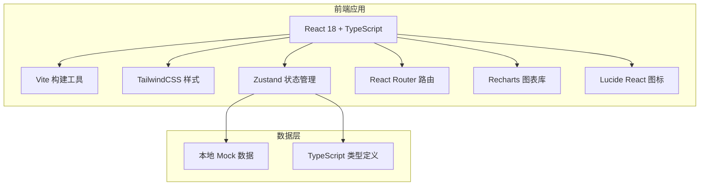
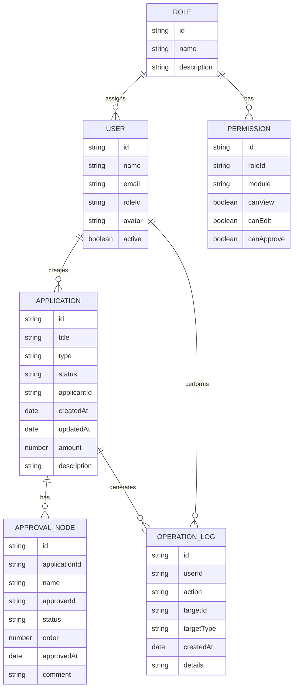

## 1. 架构设计



## 2. 技术描述

- **前端框架**: React@18 + TypeScript@5
- **构建工具**: Vite@5
- **样式方案**: TailwindCSS@3
- **状态管理**: Zustand@4
- **路由管理**: React Router Dom@6
- **图表库**: Recharts@2
- **图标库**: Lucide React@0.344
- **数据方案**: 本地 Mock 数据，无后端依赖

## 3. 路由定义

| 路由 | 页面 | 功能 |
|------|------|------|
| /dashboard | 工作台首页 | 数据概览、待办提醒、快捷入口 |
| /applications | 申请管理 | 申请列表、筛选、详情查看 |
| /workflow | 审批流程 | 审批流节点可视化、进度追踪 |
| /permissions | 权限管理 | 角色管理、权限配置、用户分配 |
| /logs | 操作记录 | 操作日志、审计追踪 |
| /analytics | 数据分析 | 统计图表、数据报表 |
| /notifications | 通知中心 | 异常提醒、待办通知 |

## 4. 数据模型

### 4.1 数据模型定义



### 4.2 TypeScript 类型定义

```typescript
// 申请状态
type ApplicationStatus = 'pending' | 'approving' | 'approved' | 'rejected' | 'archived';

// 申请类型
type ApplicationType = 'leave' | 'expense' | 'purchase' | 'contract' | 'other';

// 审批节点状态
type NodeStatus = 'pending' | 'current' | 'approved' | 'rejected' | 'skipped';

interface Application {
  id: string;
  title: string;
  type: ApplicationType;
  status: ApplicationStatus;
  applicantId: string;
  applicantName: string;
  department: string;
  createdAt: string;
  updatedAt: string;
  amount?: number;
  description: string;
  currentNode: number;
  totalNodes: number;
}

interface ApprovalNode {
  id: string;
  applicationId: string;
  name: string;
  approverId: string;
  approverName: string;
  status: NodeStatus;
  order: number;
  approvedAt?: string;
  comment?: string;
}

interface User {
  id: string;
  name: string;
  email: string;
  roleId: string;
  roleName: string;
  avatar: string;
  department: string;
  active: boolean;
}

interface Role {
  id: string;
  name: string;
  description: string;
  permissions: Permission[];
}

interface Permission {
  module: string;
  canView: boolean;
  canEdit: boolean;
  canApprove: boolean;
  canDelete: boolean;
}

interface OperationLog {
  id: string;
  userId: string;
  userName: string;
  action: string;
  targetId: string;
  targetType: string;
  targetName: string;
  createdAt: string;
  details: string;
  ip?: string;
}

interface Notification {
  id: string;
  type: 'warning' | 'error' | 'info' | 'success';
  title: string;
  message: string;
  relatedId?: string;
  createdAt: string;
  isRead: boolean;
  priority: 'high' | 'medium' | 'low';
}

interface Statistics {
  totalApplications: number;
  pendingApplications: number;
  approvedToday: number;
  avgApprovalTime: number;
  monthlyData: { month: string; count: number; approved: number }[];
  typeDistribution: { type: string; value: number }[];
  deptDistribution: { dept: string; value: number }[];
}
```

## 5. 目录结构

```
src/
├── components/          # 通用组件
│   ├── Layout/         # 布局组件
│   ├── Card/           # 卡片组件
│   ├── Table/          # 表格组件
│   ├── StatusBadge/    # 状态标签
│   └── Charts/         # 图表组件
├── pages/              # 页面组件
│   ├── Dashboard/      # 工作台
│   ├── Applications/   # 申请管理
│   ├── Workflow/       # 审批流程
│   ├── Permissions/    # 权限管理
│   ├── Logs/           # 操作记录
│   ├── Analytics/      # 数据分析
│   └── Notifications/  # 通知中心
├── store/              # Zustand 状态管理
│   ├── useApplicationStore.ts
│   ├── useUserStore.ts
│   └── useNotificationStore.ts
├── data/               # Mock 数据
│   ├── applications.ts
│   ├── users.ts
│   ├── roles.ts
│   └── logs.ts
├── types/              # TypeScript 类型
│   └── index.ts
├── utils/              # 工具函数
│   ├── format.ts
│   └── mock.ts
├── App.tsx             # 根组件
├── main.tsx            # 入口文件
└── index.css           # 全局样式
```
