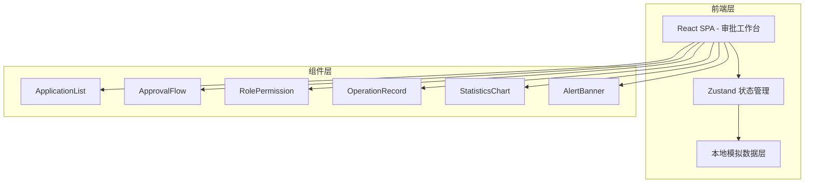
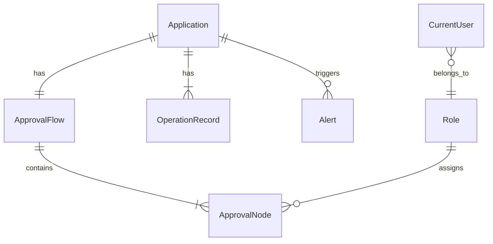

## 1. 架构设计



## 2. 技术说明

- 前端：React@18 + TypeScript + Tailwind CSS@3 + Vite
- 初始化工具：vite-init
- 后端：无（纯前端本地模拟数据）
- 数据库：无（本地 Mock 数据）
- 状态管理：Zustand
- 图表库：Recharts
- 图标：lucide-react

## 3. 路由定义

| 路由 | 用途 |
|------|------|
| / | 审批工作台主页面，包含所有模块 |

## 4. API 定义

无后端 API，所有数据通过本地 Mock 数据和 Zustand store 管理。

### 4.1 数据接口定义

```typescript
interface Application {
  id: string;
  title: string;
  applicant: string;
  department: string;
  type: "purchase" | "leave" | "expense" | "contract";
  status: "pending" | "approved" | "rejected" | "timeout";
  createdAt: string;
  amount?: number;
  flowId: string;
}

interface ApprovalNode {
  id: string;
  flowId: string;
  order: number;
  role: string;
  assignee?: string;
  status: "pending" | "approved" | "rejected" | "timeout" | "unassigned";
  operatedAt?: string;
  remark?: string;
}

interface ApprovalFlow {
  id: string;
  applicationId: string;
  nodes: ApprovalNode[];
}

interface Role {
  id: string;
  name: string;
  permissions: string[];
  level: number;
}

interface OperationRecord {
  id: string;
  applicationId: string;
  operator: string;
  operatorRole: string;
  action: "approve" | "reject" | "submit" | "withdraw" | "reassign" | "comment";
  timestamp: string;
  remark: string;
  nodeId?: string;
}

interface Alert {
  id: string;
  type: "missing_approver" | "timeout" | "permission_violation";
  applicationId: string;
  message: string;
  severity: "warning" | "error" | "info";
  createdAt: string;
  dismissed: boolean;
}

interface CurrentUser {
  id: string;
  name: string;
  roleId: string;
  department: string;
}
```

## 5. 服务端架构

不适用

## 6. 数据模型

### 6.1 数据模型定义



### 6.2 本地模拟数据

通过 `src/data/mockData.ts` 文件提供完整模拟数据集，包含：
- 12 条申请记录（覆盖各状态和类型）
- 4 条审批流（每条申请一个流，含 3-5 个节点）
- 4 个角色定义
- 30+ 条操作记录
- 8 条异常提醒（含缺审批人、超时、越权尝试）
- 1 个当前登录用户（可切换角色）
