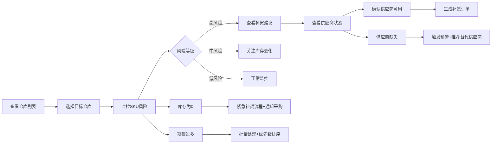

# 库存补货协同看板 - 产品需求文档

## 1. 产品概述

库存补货协同看板是一个面向供应链管理人员的实时监控与决策支持系统，旨在通过可视化方式展示多仓库库存状态、SKU风险预警、补货建议和供应商协同信息，帮助用户快速识别问题并做出补货决策。

- 核心目标：降低缺货风险，优化库存周转率，提升供应链协同效率
- 目标用户：供应链经理、仓库管理员、采购专员

## 2. 核心功能

### 2.1 用户角色

| 角色 | 登录方式 | 核心权限 |
|------|----------|----------|
| 供应链管理员 | 本地访问 | 查看所有看板数据、模拟预警、导出报表 |
| 仓库管理员 | 本地访问 | 查看对应仓库数据、处理库存预警 |
| 采购专员 | 本地访问 | 查看补货建议、供应商协同信息 |

### 2.2 功能模块

1. **仓库列表**：多仓库概览、库存健康度评分、快速切换
2. **SKU风险监控**：风险等级分类、库存详情、关联补货建议
3. **补货建议**：智能推荐补货量、优先级排序、一键生成采购单
4. **供应商协同**：供应商状态、交付时效、联系信息
5. **趋势概览**：库存趋势、缺货预测、补货历史
6. **本地模拟预警**：自定义预警参数、模拟缺货场景、验证处理逻辑

### 2.3 页面详情

| 页面名称 | 模块名称 | 功能描述 |
|----------|----------|----------|
| 主看板 | 仓库列表卡片 | 展示所有仓库库存总览、健康度评分、点击切换仓库 |
| 主看板 | SKU风险面板 | 按风险等级（高/中/低）分类展示SKU，支持筛选排序 |
| 主看板 | 补货建议面板 | 智能推荐补货数量、优先级、预计到货时间 |
| 主看板 | 供应商协同面板 | 展示活跃供应商列表、交付状态、响应时间 |
| 主看板 | 趋势图表 | 近30天库存趋势、未来7天缺货预测 |
| 模拟预警 | 参数配置 | 自定义安全库存阈值、预警触发条件 |
| 模拟预警 | 场景模拟 | 模拟库存为0、供应商缺失、预警过多等异常场景 |
| 模拟预警 | 处理逻辑 | 展示各类异常场景下的系统处理流程和建议 |

## 3. 核心流程

## 4. 用户界面设计

### 4.1 设计风格

- **主色调**：深海蓝 (#0F3460) - 代表专业和可靠
- **辅助色**：
  - 高风险警示红 (#E94560)
  - 中风险警告橙 (#FF9F1C)
  - 低风险安全绿 (#2EC4B6)
  - 信息蓝 (#165DFF)
- **中性色**：深灰 (#1A1A2E)、中灰 (#4A4A68)、浅灰 (#F5F5F7)
- **卡片风格**：圆角12px，微阴影，悬浮上浮效果
- **字体**：Inter 系列字体，清晰易读的信息层级
- **布局**：响应式网格布局，卡片式模块组合

### 4.2 页面设计概览

| 页面名称 | 模块名称 | UI 元素 |
|----------|----------|----------|
| 主看板 | 顶部导航 | Logo、时间筛选、刷新按钮、用户头像 |
| 主看板 | KPI概览 | 总SKU数、缺货数、在途数、健康度评分 |
| 主看板 | 仓库列表 | 左侧垂直列表，选中态高亮，健康度环形图 |
| 主看板 | SKU风险面板 | 标签页切换（高/中/低），数据表格带操作按钮 |
| 主看板 | 补货建议面板 | 优先级卡片，进度条，一键补货按钮 |
| 主看板 | 供应商面板 | 状态徽章，交付时效图表，联系按钮 |
| 主看板 | 趋势图表 | 面积图，数据点悬浮提示，时间轴缩放 |
| 模拟预警 | 配置面板 | 滑块控件，开关按钮，预设模板 |
| 模拟预警 | 场景演示 | 步骤指示器，动画演示，代码/逻辑展示 |

### 4.3 响应式设计

- **桌面端** (1440px+)：6列网格，侧边栏展开，全量数据展示
- **平板端** (768px-1439px)：4列网格，侧边栏可收起，核心数据展示
- **移动端** (768px-)：单列布局，底部导航，关键指标卡片

### 4.4 动效设计

- 页面加载：卡片渐入+位移动画，错落延迟
- 数据刷新：数字滚动效果，图表重绘过渡
- 风险预警：呼吸灯效果，边框脉动
- 交互反馈：按钮点击缩放，卡片悬浮阴影加深
