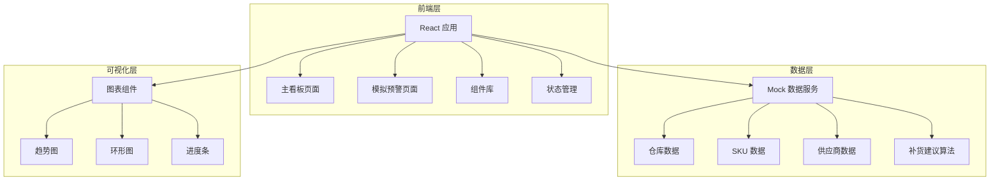
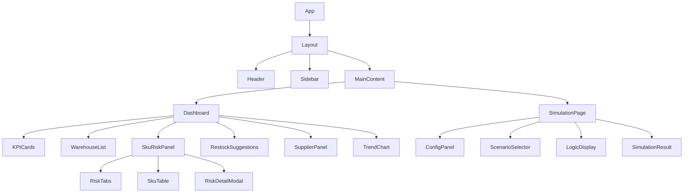

# 库存补货协同看板 - 技术架构文档

## 1. 架构设计



## 2. 技术选型

- **前端框架**：React@18 + TypeScript
- **构建工具**：Vite@5
- **样式方案**：TailwindCSS@3
- **图表库**：Recharts@2
- **图标库**：Lucide React
- **状态管理**：React Context + Hooks
- **路由**：React Router@6

## 3. 路由定义

| 路由 | 页面 | 功能 |
|------|------|------|
| / | 主看板 | 仓库列表、SKU风险、补货建议、供应商协同、趋势概览 |
| /simulation | 模拟预警 | 预警参数配置、场景模拟、处理逻辑展示 |

## 4. 数据模型

### 4.1 核心数据结构

```typescript
// 仓库
interface Warehouse {
  id: string;
  name: string;
  location: string;
  totalSkus: number;
  outOfStock: number;
  inTransit: number;
  healthScore: number; // 0-100
  status: 'normal' | 'warning' | 'critical';
}

// SKU
interface Sku {
  id: string;
  name: string;
  code: string;
  category: string;
  currentStock: number;
  safetyStock: number;
  avgDailyConsumption: number;
  riskLevel: 'high' | 'medium' | 'low';
  supplierId: string | null;
  expectedDaysToOut: number;
  lastRestockDate: string;
}

// 补货建议
interface RestockSuggestion {
  id: string;
  skuId: string;
  skuName: string;
  suggestedQuantity: number;
  priority: 'urgent' | 'high' | 'medium' | 'low';
  estimatedArrivalDate: string;
  supplierId: string;
  reason: string;
}

// 供应商
interface Supplier {
  id: string;
  name: string;
  status: 'active' | 'inactive' | 'delayed';
  averageDeliveryTime: number; // 天数
  onTimeRate: number; // 百分比
  contactPerson: string;
  contactPhone: string;
  supportedSkus: string[];
}

// 库存趋势
interface StockTrend {
  date: string;
  totalStock: number;
  outOfStockCount: number;
  restockCount: number;
}
```

### 4.2 风险计算逻辑

```typescript
// 高风险条件
function calculateRiskLevel(sku: Sku): 'high' | 'medium' | 'low' {
  const daysToOut = sku.currentStock / sku.avgDailyConsumption;
  
  if (sku.currentStock === 0 || daysToOut <= 3) {
    return 'high';
  } else if (daysToOut <= 7 || sku.currentStock < sku.safetyStock * 0.5) {
    return 'medium';
  } else {
    return 'low';
  }
}
```

### 4.3 异常处理逻辑

```typescript
// 库存为0处理
function handleZeroStock(sku: Sku): ProcessingResult {
  return {
    level: 'critical',
    actions: [
      '触发紧急补货流程',
      '通知采购专员',
      '推荐替代SKU',
      '检查附近仓库库存'
    ],
    suggestedSupplier: findAlternativeSupplier(sku)
  };
}

// 供应商缺失处理
function handleMissingSupplier(sku: Sku): ProcessingResult {
  return {
    level: 'warning',
    actions: [
      '标记该SKU供应商待分配',
      '推荐历史供应商',
      '触发采购寻源流程'
    ],
    alternativeSuppliers: findMatchingSuppliers(sku.category)
  };
}

// 预警过多处理
function handleTooManyAlerts(alerts: Alert[]): ProcessingResult {
  const prioritized = alerts.sort((a, b) => {
    const priorityMap = { critical: 0, high: 1, medium: 2, low: 3 };
    return priorityMap[a.level] - priorityMap[b.level];
  });
  
  return {
    level: 'info',
    actions: [
      '按优先级批量处理',
      '建议设置自动补货规则',
      '优化安全库存阈值'
    ],
    batchProcessList: prioritized.slice(0, 10)
  };
}
```

## 5. 组件架构



## 6. 文件结构

```
src/
├── components/
│   ├── layout/
│   │   ├── Header.tsx
│   │   ├── Sidebar.tsx
│   │   └── Layout.tsx
│   ├── dashboard/
│   │   ├── KPICard.tsx
│   │   ├── WarehouseList.tsx
│   │   ├── SkuRiskPanel.tsx
│   │   ├── RestockSuggestions.tsx
│   │   ├── SupplierPanel.tsx
│   │   └── TrendChart.tsx
│   ├── simulation/
│   │   ├── ConfigPanel.tsx
│   │   ├── ScenarioSelector.tsx
│   │   └── LogicDisplay.tsx
│   └── ui/
│       ├── Card.tsx
│       ├── Badge.tsx
│       ├── Progress.tsx
│       └── Button.tsx
├── pages/
│   ├── Dashboard.tsx
│   └── Simulation.tsx
├── data/
│   ├── mockData.ts
│   └── types.ts
├── hooks/
│   ├── useWarehouse.ts
│   ├── useSkuRisk.ts
│   └── useSimulation.ts
├── utils/
│   ├── riskCalculator.ts
│   └── restockAlgorithm.ts
├── App.tsx
├── main.tsx
└── index.css
```
