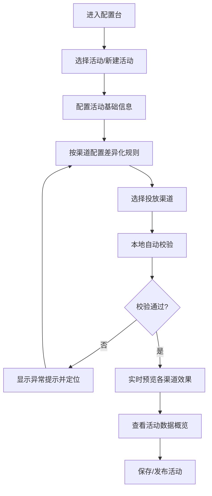

## 1. 产品概述

跨端运营活动配置台，为运营人员提供一站式活动创建、规则配置、渠道投放、效果预览与数据分析能力。解决多渠道活动配置分散、规则差异维护困难、效果无法实时预览等痛点。

- 核心用户：运营团队、活动策划人员
- 核心价值：提升活动配置效率，降低跨渠道维护成本，通过实时校验减少上线风险

## 2. 核心特性

### 2.1 用户角色

| 角色 | 注册方式 | 核心权限 |
|------|----------|----------|
| 运营管理员 | 企业账号登录 | 活动全生命周期管理、渠道配置、数据查看 |
| 活动运营 | 企业账号登录 | 活动创建与编辑、规则配置、预览测试 |

### 2.2 功能模块

1. **活动列表**：活动创建、搜索筛选、状态管理、批量操作
2. **规则编辑**：活动规则配置、渠道差异化规则、条件组合配置
3. **投放渠道**：渠道选择与配置、渠道可用性检查、渠道参数配置
4. **实时预览**：活动效果多端预览、渠道差异对比、与当前编辑联动
5. **数据概览**：活动核心指标展示、趋势分析、渠道数据对比、与选中活动联动
6. **本地校验**：规则完整性校验、渠道可用性检查、异常提示与定位

### 2.3 页面详情

| 页面名称 | 模块名称 | 功能描述 |
|-----------|-------------|---------------------|
| 主工作台 | 活动列表 | 活动卡片列表、搜索筛选、状态标签、创建入口 |
| 主工作台 | 规则编辑器 | 可视化规则配置、渠道切换、条件/动作编辑 |
| 主工作台 | 投放渠道面板 | 渠道列表、开关控制、参数配置、可用性标识 |
| 主工作台 | 实时预览区 | 多设备模拟器、渠道切换预览、实时渲染 |
| 主工作台 | 数据概览面板 | 核心指标卡片、趋势图表、渠道数据对比 |
| 主工作台 | 校验提示栏 | 错误列表、警告提示、一键定位修复 |

## 3. 核心流程

用户选择或创建活动 → 配置活动基础信息 → 按渠道差异化配置活动规则 → 选择投放渠道并配置参数 → 本地校验检查规则完整性与渠道可用性 → 实时预览各渠道展示效果 → 查看活动历史数据趋势 → 确认无误后保存/发布活动

## 4. 界面设计

### 4.1 设计风格
- **主色调**：深空蓝 (#1E3A5F) 作为主色，搭配科技青 (#2DD4BF) 作为强调色，中性灰 (#374151) 作为文字主色
- **视觉风格**：现代科技仪表盘风格，深色导航 + 浅色内容区，层次分明
- **按钮风格**：圆角矩形按钮，主按钮带有微妙渐变，hover 时有轻微上浮效果
- **字体**：标题使用 "Space Grotesk" 无衬线字体，正文使用 "Inter" 确保可读性
- **布局**：左侧导航 + 顶部工具栏 + 三栏内容区（左：活动列表，中：编辑区，右：预览/数据）
- **图标风格**：线性简约图标，统一 24px 尺寸，使用 Lucide 图标库

### 4.2 页面设计概览

| 页面名称 | 模块名称 | UI 元素 |
|-----------|-------------|----------|
| 主工作台 | 活动列表 | 卡片式布局、状态色标、搜索框、筛选下拉、分页 |
| 主工作台 | 规则编辑器 | 表单分组、渠道标签页、动态添加规则、拖拽排序 |
| 主工作台 | 投放渠道面板 | 渠道卡片、启用开关、状态指示灯、参数展开面板 |
| 主工作台 | 实时预览区 | 设备外框模拟、渠道切换按钮、实时渲染区 |
| 主工作台 | 数据概览面板 | 指标卡片、迷你趋势图、柱状对比图、时间筛选 |
| 主工作台 | 校验提示栏 | 错误/警告图标、消息列表、点击跳转定位 |

### 4.3 响应式
- 桌面端（>=1280px）：完整三栏布局，活动列表 280px，编辑区自适应，预览区 400px
- 平板端（768px-1279px）：两栏布局，活动列表可折叠，预览区改为底部面板
- 移动端（<768px）：单栏布局，Tab 切换各模块

### 4.4 交互细节
- 规则编辑时实时校验，错误字段红框高亮并显示提示
- 渠道切换时预览区和规则区同步切换对应渠道配置
- 选择不同活动时数据概览自动刷新为对应活动数据
- 空活动状态提供引导式创建流程
- 规则缺字段时显示明确的缺失项列表
- 渠道不可用时灰色禁用并显示原因
