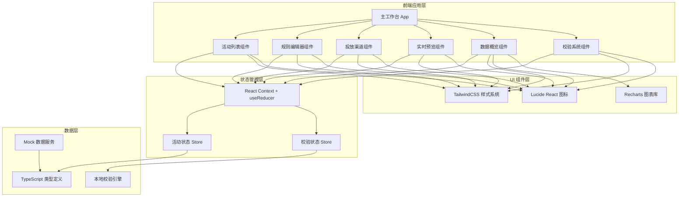
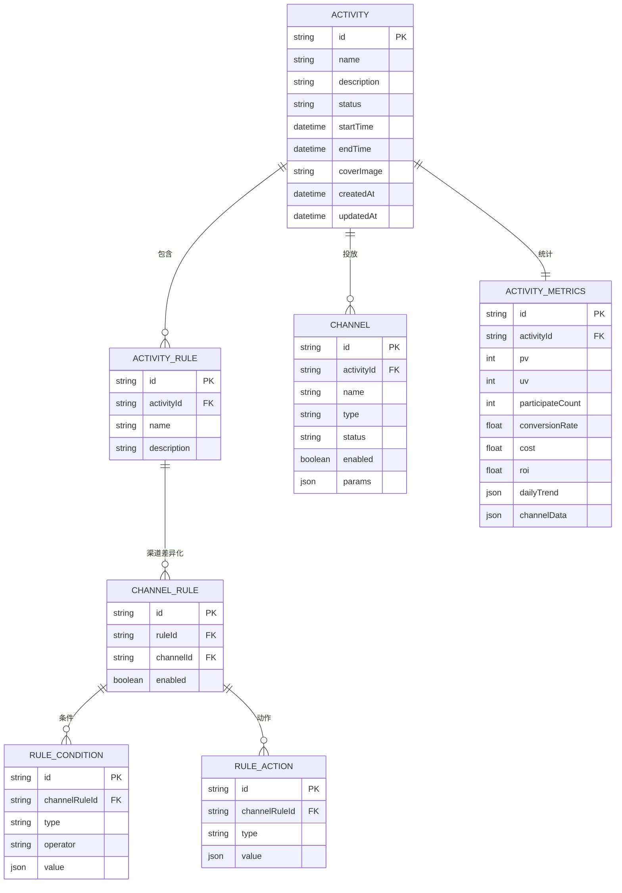
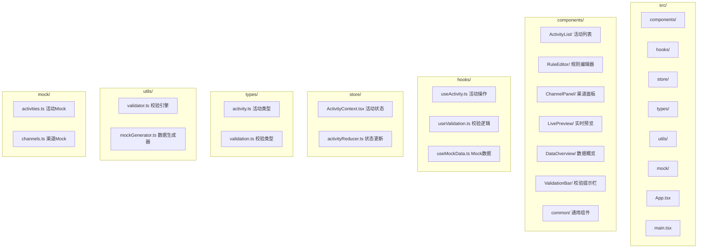

## 1. 架构设计



## 2. 技术选型

- **前端框架**：React@18 + TypeScript@5
- **构建工具**：Vite@5
- **样式方案**：TailwindCSS@3 + PostCSS
- **状态管理**：React Context + useReducer（轻量场景，无需 Redux）
- **图标库**：Lucide React
- **图表库**：Recharts
- **表单处理**：React Hook Form
- **数据校验**：Zod（配合自定义校验引擎）
- **后端**：无，使用 Mock 数据模拟所有接口
- **数据库**：无，数据存储在浏览器 localStorage

## 3. 路由定义

| 路由 | 用途 |
|-------|---------|
| / | 主工作台，包含所有功能模块 |
| /activity/:id | 指定活动的编辑页面，带参数定位 |

说明：单页应用设计，所有模块在同一页面内通过状态切换展示，无需多路由。

## 4. 数据模型

### 4.1 核心数据类型定义

```typescript
// 活动状态
type ActivityStatus = 'draft' | 'pending' | 'active' | 'paused' | 'ended';

// 渠道类型
type ChannelType = 'wechat' | 'alipay' | 'app' | 'h5' | 'miniprogram';

// 渠道状态
type ChannelStatus = 'available' | 'unavailable' | 'maintenance';

// 规则条件类型
type RuleConditionType = 'user_level' | 'consume_amount' | 'sign_days' | 'region' | 'time_range';

// 规则动作类型
type RuleActionType = 'discount' | 'coupon' | 'points' | 'gift' | 'red_packet';

// 投放渠道
interface Channel {
  id: string;
  name: string;
  type: ChannelType;
  status: ChannelStatus;
  enabled: boolean;
  unavailableReason?: string;
  params: Record<string, any>;
}

// 规则条件
interface RuleCondition {
  id: string;
  type: RuleConditionType;
  operator: 'eq' | 'ne' | 'gt' | 'lt' | 'gte' | 'lte' | 'in' | 'between';
  value: any;
  label: string;
}

// 规则动作
interface RuleAction {
  id: string;
  type: RuleActionType;
  value: any;
  label: string;
}

// 渠道规则（差异化配置）
interface ChannelRule {
  channelId: string;
  conditions: RuleCondition[];
  actions: RuleAction[];
  enabled: boolean;
}

// 活动规则
interface ActivityRule {
  id: string;
  name: string;
  description: string;
  channelRules: ChannelRule[];
}

// 活动数据指标
interface ActivityMetrics {
  pv: number;
  uv: number;
  participateCount: number;
  conversionRate: number;
  cost: number;
  roi: number;
  dailyTrend: { date: string; pv: number; uv: number; conversion: number }[];
  channelData: { channel: string; pv: number; uv: number; conversion: number }[];
}

// 活动主对象
interface Activity {
  id: string;
  name: string;
  description: string;
  status: ActivityStatus;
  startTime: string;
  endTime: string;
  coverImage: string;
  rules: ActivityRule[];
  channels: Channel[];
  metrics: ActivityMetrics;
  createdAt: string;
  updatedAt: string;
}

// 校验结果
interface ValidationResult {
  valid: boolean;
  errors: ValidationItem[];
  warnings: ValidationItem[];
}

interface ValidationItem {
  id: string;
  type: 'error' | 'warning';
  field: string;
  message: string;
  location: string;
}
```

### 4.2 ER 关系图



## 5. 模块划分



## 6. 核心校验规则

1. **活动基础信息校验**：
   - 活动名称不能为空，长度限制 2-50 字符
   - 开始时间必须早于结束时间
   - 活动描述不能为空
   - 必须上传封面图

2. **规则完整性校验**：
   - 至少配置一条规则
   - 每条规则至少包含一个条件和一个动作
   - 条件值不能为空且格式正确
   - 动作值不能为空且在合理范围内

3. **渠道校验**：
   - 至少选择一个可用渠道
   - 已启用渠道必须配置对应渠道规则
   - 渠道参数完整性校验
   - 渠道状态检查（不可用渠道需提示原因）

4. **边界情况处理**：
   - 空活动：显示引导创建流程
   - 规则缺字段：高亮缺失字段并列出清单
   - 渠道不可用：禁用并显示原因，不允许选择
   - 时间冲突：与同渠道其他活动时间重叠时警告
