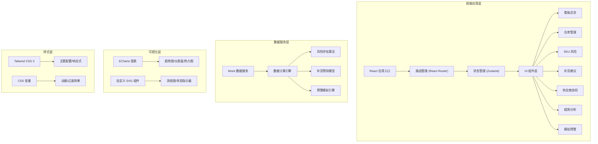
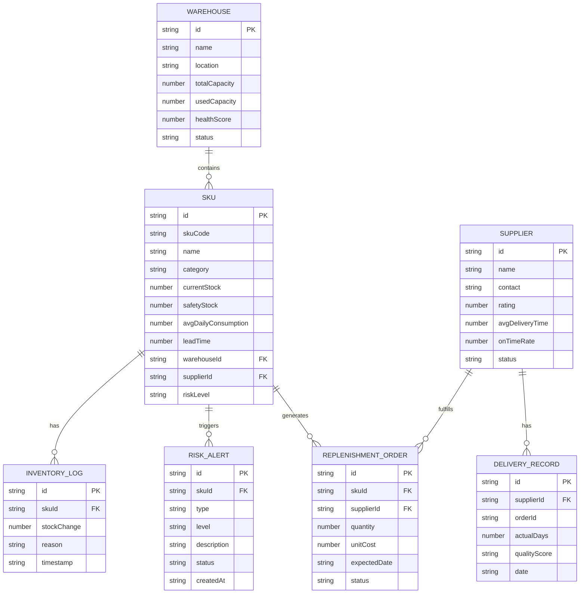
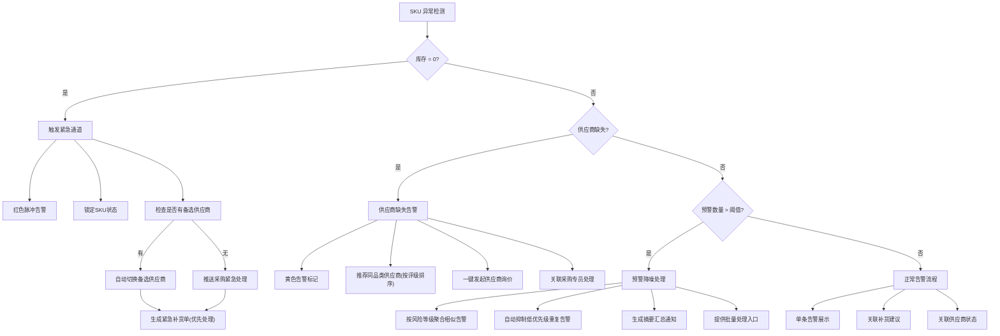

## 1. 架构设计



## 2. 技术选型说明

- **前端框架**：React@18 + TypeScript，强类型保障数据安全
- **构建工具**：Vite@5，快速热更新，开发体验佳
- **路由管理**：React Router@6，单页应用路由
- **状态管理**：Zustand，轻量级状态管理，适合中后台应用
- **UI 样式**：Tailwind CSS@3，原子化 CSS，快速构建界面
- **图表库**：ECharts@5，强大的数据可视化能力
- **图标库**：Lucide React，简洁现代的图标
- **动画**：Framer Motion，流畅的交互动画
- **数据**：本地 Mock 数据，模拟真实业务场景
- **日期处理**：date-fns，轻量级日期工具库

## 3. 路由定义

| 路由路径 | 页面名称 | 主要功能 |
|---------|----------|---------|
| /dashboard | 总览看板 | 全局 KPI、预警轮播、风险分布 |
| /warehouses | 仓库列表 | 仓库状态、库容分析、详情查看 |
| /sku-risk | SKU 风险 | 风险分层、异常处理、联动面板 |
| /replenishment | 补货建议 | 智能计算、优先级、批量操作 |
| /suppliers | 供应商协同 | 供应商评级、订单追踪、交付分析 |
| /trends | 趋势概览 | 库存趋势、预测分析、多维度对比 |
| /simulation | 模拟预警 | 参数配置、场景模拟、逻辑可视化 |

## 4. 数据模型定义

### 4.1 核心数据结构



### 4.2 风险评估算法

```typescript
// 风险等级计算逻辑
function calculateRiskLevel(sku: SKU): RiskLevel {
    const stockDays = sku.currentStock / sku.avgDailyConsumption;
    const safetyRatio = sku.currentStock / sku.safetyStock;
    
    // 库存为0 - 紧急风险
    if (sku.currentStock === 0) {
        return { level: 'critical', reason: 'STOCK_ZERO' };
    }
    
    // 供应商缺失
    if (!sku.supplierId) {
        return { level: 'critical', reason: 'NO_SUPPLIER' };
    }
    
    // 库存低于安全库存的30%
    if (safetyRatio < 0.3) {
        return { level: 'high', reason: 'EXTREMELY_LOW' };
    }
    
    // 库存低于安全库存
    if (safetyRatio < 1) {
        return { level: 'high', reason: 'BELOW_SAFETY' };
    }
    
    // 可售天数小于补货提前期
    if (stockDays < sku.leadTime) {
        return { level: 'medium', reason: 'LEAD_TIME_RISK' };
    }
    
    // 可售天数小于补货提前期+安全缓冲(3天)
    if (stockDays < sku.leadTime + 3) {
        return { level: 'medium', reason: 'BUFFER_RISK' };
    }
    
    return { level: 'low', reason: 'NORMAL' };
}
```

### 4.3 补货建议计算

```typescript
// 经济订货批量(EOQ)模型
function calculateReplenishment(sku: SKU): ReplenishmentSuggestion {
    const { currentStock, safetyStock, avgDailyConsumption, leadTime } = sku;
    
    // 目标库存 = 安全库存 + (日均消耗 × (补货提前期 + 补货周期))
    const targetStock = safetyStock + (avgDailyConsumption * (leadTime + 7));
    
    // 建议补货量 = 目标库存 - 当前库存
    const suggestedQuantity = Math.max(0, Math.ceil(targetStock - currentStock));
    
    // 优先级计算
    const priority = calculatePriority(sku, suggestedQuantity);
    
    return {
        skuId: sku.id,
        suggestedQuantity,
        expectedDate: addDays(new Date(), leadTime),
        estimatedCost: suggestedQuantity * sku.unitCost,
        priority
    };
}
```

## 5. 页面组件结构

```
src/
├── components/
│   ├── layout/
│   │   ├── Sidebar.tsx        # 侧边导航
│   │   ├── Header.tsx         # 顶部状态栏
│   │   └── Layout.tsx         # 布局容器
│   ├── common/
│   │   ├── KPICard.tsx        # KPI卡片
│   │   ├── StatusBadge.tsx    # 状态徽章
│   │   ├── RiskTag.tsx        # 风险标签
│   │   ├── DataTable.tsx      # 数据表格
│   │   └── LoadingSkeleton.tsx # 骨架屏
│   ├── dashboard/
│   │   ├── KPIGrid.tsx        # KPI网格
│   │   ├── AlertTicker.tsx    # 预警轮播
│   │   └── RiskHeatmap.tsx    # 风险热力图
│   ├── warehouses/
│   │   ├── WarehouseCard.tsx  # 仓库卡片
│   │   ├── CapacityChart.tsx  # 库容图表
│   │   └── WarehouseDrawer.tsx # 仓库详情抽屉
│   ├── sku-risk/
│   │   ├── RiskFilter.tsx     # 风险筛选器
│   │   ├── RiskTable.tsx      # 风险表格
│   │   ├── RiskDetailPanel.tsx # 风险详情面板
│   │   ├── StockZeroHandler.tsx # 库存为0处理
│   │   ├── NoSupplierHandler.tsx # 供应商缺失处理
│   │   └── AlertNoiseReducer.tsx # 预警降噪
│   ├── replenishment/
│   │   ├── SuggestionList.tsx # 补货建议列表
│   │   ├── PriorityBar.tsx    # 优先级条
│   │   └── BatchActionBar.tsx # 批量操作栏
│   ├── suppliers/
│   │   ├── SupplierCard.tsx   # 供应商卡片
│   │   ├── RatingStars.tsx    # 星级评分
│   │   ├── DeliveryChart.tsx  # 交付时效图
│   │   └── OnTimeGauge.tsx    # 准交率仪表盘
│   ├── trends/
│   │   ├── TrendChart.tsx     # 趋势图表
│   │   ├── ForecastCurve.tsx  # 预测曲线
│   │   └── ComparisonChart.tsx # 对比图表
│   └── simulation/
│       ├── ParamSlider.tsx    # 参数滑块
│       ├── SceneSelector.tsx  # 场景选择器
│       ├── SimulationResult.tsx # 模拟结果
│       └── LogicFlowChart.tsx # 逻辑流程图
├── pages/
│   ├── Dashboard.tsx
│   ├── Warehouses.tsx
│   ├── SkuRisk.tsx
│   ├── Replenishment.tsx
│   ├── Suppliers.tsx
│   ├── Trends.tsx
│   └── Simulation.tsx
├── store/
│   ├── useInventoryStore.ts   # 库存状态管理
│   ├── useSupplierStore.ts    # 供应商状态管理
│   └── useSimulationStore.ts  # 模拟状态管理
├── data/
│   ├── mockWarehouses.ts      # 仓库Mock数据
│   ├── mockSKUs.ts            # SKU Mock数据
│   ├── mockSuppliers.ts       # 供应商Mock数据
│   └── mockOrders.ts          # 订单Mock数据
├── utils/
│   ├── riskCalculator.ts      # 风险计算工具
│   ├── replenishmentEngine.ts # 补货计算引擎
│   ├── simulationEngine.ts    # 模拟引擎
│   └── formatters.ts          # 格式化工具
├── types/
│   └── index.ts               # 类型定义
├── App.tsx
├── main.tsx
└── index.css
```

## 6. 异常处理逻辑可视化


