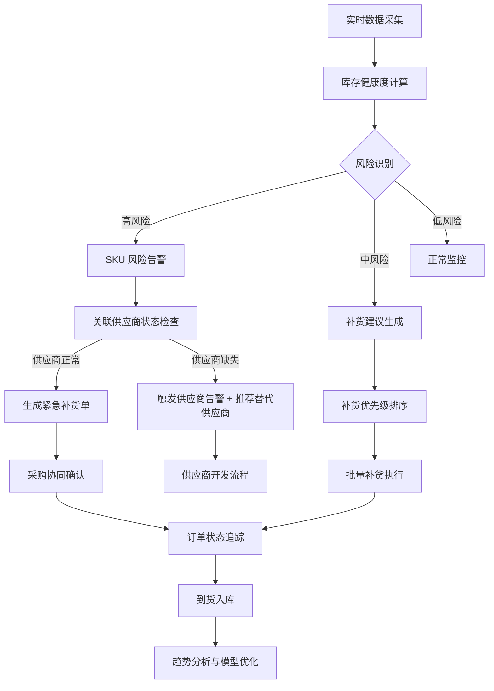

## 1. 产品概述

库存补货协同看板是面向供应链管理人员的实时决策支持系统，整合仓库库存、SKU 风险、补货建议、供应商协同、趋势分析和预警模拟六大核心模块，实现库存异常的快速识别与闭环处理。

- 核心价值：通过多维度数据联动，将库存风险转化为可执行的补货动作，降低缺货损失，提升供应链协同效率
- 目标用户：供应链经理、库存专员、采购专员、运营分析人员

## 2. 核心 Features

### 2.1 用户角色

| 角色 | 核心权限 |
|------|----------|
| 供应链经理 | 全局视图、风险审批、趋势分析、预警配置 |
| 库存专员 | 仓库管理、SKU 监控、风险确认、补货执行 |
| 采购专员 | 供应商管理、订单协同、补货确认 |
| 运营分析 | 趋势查看、数据导出、模拟分析 |

### 2.2 Feature 模块

1. **总览看板**：全局指标卡片、关键 KPI、实时预警轮播
2. **仓库列表**：多仓库状态总览、库容分析、库存分布
3. **SKU 风险**：风险等级分层、异常明细、关联建议与供应商
4. **补货建议**：智能补货计算、一键生成订单、补货优先级
5. **供应商协同**：供应商评级、交付时效、订单状态追踪
6. **趋势概览**：库存趋势、消耗预测、补货效果分析
7. **模拟预警**：本地参数配置、预警模拟、场景推演、处理逻辑可视化

### 2.3 页面详情

| 页面名称 | 模块名称 | 功能描述 |
|---------|----------|----------|
| 总览看板 | 全局 KPI 卡片 | 实时库存总额、缺货 SKU 数、在途订单、预警数 |
| 总览看板 | 风险分布热力图 | 按仓库+SKU 维度展示风险分布 |
| 仓库列表 | 仓库状态列表 | 仓库基础信息、库容使用率、健康度评分 |
| 仓库列表 | 仓库详情抽屉 | 单个仓库的 SKU 明细、库容曲线、作业状态 |
| SKU 风险 | 风险等级分层 | 高/中/低风险 SKU 分类展示，支持筛选 |
| SKU 风险 | 风险详情面板 | 库存趋势、补货建议、关联供应商状态联动展示 |
| SKU 风险 | 异常处理逻辑 | 库存为 0 紧急通道、供应商缺失告警、预警过多降噪 |
| 补货建议 | 补货计算结果 | 建议补货量、预计到货日、成本估算、优先级排序 |
| 补货建议 | 批量操作 | 全选/多选、一键生成采购单、批量确认 |
| 供应商协同 | 供应商列表 | 评级、平均交付时效、准交率、在途订单数 |
| 供应商协同 | 供应商详情 | 历史交付记录、质量评分、联系方式、合同状态 |
| 趋势概览 | 多维度图表 | 库存消耗趋势、预测曲线、补货效果对比 |
| 趋势概览 | 自定义分析 | 时间范围选择、SKU 分组、仓库对比 |
| 模拟预警 | 参数配置 | 安全库存系数、预警阈值、补货提前期可调整 |
| 模拟预警 | 场景模拟 | 库存为 0、供应商断供、需求突增等极端场景推演 |
| 模拟预警 | 处理逻辑可视化 | 展示不同异常场景下的系统处理流程与决策路径 |

## 3. 核心流程

## 4. 用户界面设计

### 4.1 设计风格

- **主色调**：深空灰 (#0F172A) 为背景，数据蓝 (#3B82F6) 为主色，警告橙 (#F59E0B)、危险红 (#EF4444)、成功绿 (#10B981) 为状态色
- **视觉风格**：工业数据可视化风格，深色主题适合长时间监控，数据层级清晰，关键信息高亮
- **字体**：标题使用 Space Grotesk，正文字体使用 Inter，数字使用等宽字体 JetBrains Mono
- **布局**：左侧导航 + 顶部状态栏 + 主内容区的经典 B 端布局，卡片化模块，支持拖拽自定义
- **交互**：悬停放大、选中高亮、平滑过渡动画，数据加载骨架屏

### 4.2 页面设计概览

| 页面名称 | 模块名称 | UI 元素 |
|---------|----------|---------|
| 总览看板 | KPI 卡片组 | 渐变背景、数字跳动动画、趋势箭头、状态指示灯 |
| 总览看板 | 风险预警条 | 横向滚动轮播、点击跳转详情、颜色区分等级 |
| 仓库列表 | 仓库卡片网格 | 卡片悬停上浮、健康度进度条、库容环形图 |
| SKU 风险 | 风险表格 | 行悬停展开详情、风险标签彩色、状态徽章 |
| SKU 风险 | 联动面板 | 三栏布局：SKU 基本信息 + 补货建议 + 供应商状态 |
| 补货建议 | 优先级队列 | 排序条、批量操作栏、确认动效 |
| 供应商协同 | 评级卡片 | 星级评分、交付时效曲线图、准交率仪表盘 |
| 趋势概览 | 图表区域 | 多线条趋势图、区域填充、数据点悬停提示 |
| 模拟预警 | 控制面板 | 滑块调节、开关切换、模拟按钮脉冲动效 |
| 模拟预警 | 逻辑流程图 | 节点高亮、路径动画、条件分支标注 |

### 4.3 响应式设计

- 桌面端优先设计，支持 1920×1080 及以上分辨率
- 平板端自适应布局，侧边栏可收起
- 移动端保留核心 KPI 和预警功能，表格转为卡片列表

### 4.4 动效设计

- 页面加载：模块从上到下依次淡入，错开 100ms
- 数据更新：数字滚动动画，新数据高亮闪烁
- 风险告警：红色脉冲动画，严重告警持续呼吸效果
- 面板切换：平滑过渡，内容区淡入淡出
- 按钮交互：悬停缩放 + 阴影加深，点击反馈
